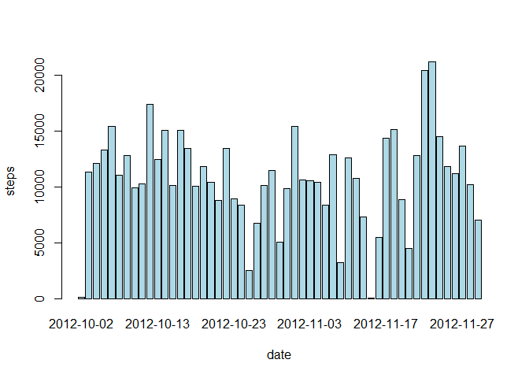
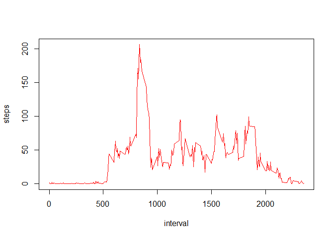
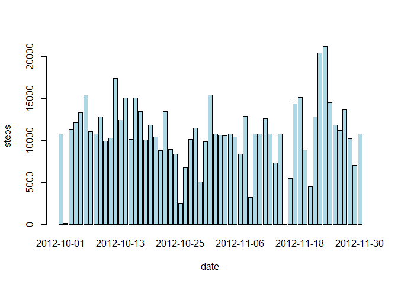
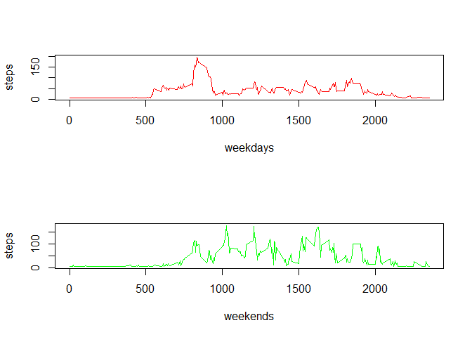

# Reproducible Research: Peer Assessment 1


## Loading and preprocessing the data


```r
unzip("activity.zip")
data<-read.csv('activity.csv')
head(data)
```

```
##   steps       date interval
## 1    NA 2012-10-01        0
## 2    NA 2012-10-01        5
## 3    NA 2012-10-01       10
## 4    NA 2012-10-01       15
## 5    NA 2012-10-01       20
## 6    NA 2012-10-01       25
```

```r
tail(data)
```

```
##       steps       date interval
## 17563    NA 2012-11-30     2330
## 17564    NA 2012-11-30     2335
## 17565    NA 2012-11-30     2340
## 17566    NA 2012-11-30     2345
## 17567    NA 2012-11-30     2350
## 17568    NA 2012-11-30     2355
```

```r
str(data)
```

```
## 'data.frame':	17568 obs. of  3 variables:
##  $ steps   : int  NA NA NA NA NA NA NA NA NA NA ...
##  $ date    : Factor w/ 61 levels "2012-10-01","2012-10-02",..: 1 1 1 1 1 1 1 1 1 1 ...
##  $ interval: int  0 5 10 15 20 25 30 35 40 45 ...
```

```r
summary(data)
```

```
##      steps                date          interval     
##  Min.   :  0.00   2012-10-01:  288   Min.   :   0.0  
##  1st Qu.:  0.00   2012-10-02:  288   1st Qu.: 588.8  
##  Median :  0.00   2012-10-03:  288   Median :1177.5  
##  Mean   : 37.38   2012-10-04:  288   Mean   :1177.5  
##  3rd Qu.: 12.00   2012-10-05:  288   3rd Qu.:1766.2  
##  Max.   :806.00   2012-10-06:  288   Max.   :2355.0  
##  NA's   :2304     (Other)   :15840
```


## What is mean total number of steps taken per day?


```r
histdata <- aggregate(steps ~ date, data = data, sum)
barplot(histdata$steps,width=1, names.arg = histdata$date, xlab = 'date', ylab = 'steps',col='lightblue')
```

 

```r
MeanSteps<-mean(histdata$steps, na.rm = TRUE)
MeanSteps
```

```
## [1] 10766.19
```

```r
MedSteps<-median(histdata$steps,na.rm=TRUE)
MedSteps
```

```
## [1] 10765
```

## What is the average daily activity pattern?

```r
dailydata <- aggregate(steps ~ interval, data =data, FUN = mean)
plot(dailydata, type = "l",col='red')
```

 

```r
dailydata$interval[which(dailydata$steps==max(dailydata$steps))]
```

```
## [1] 835
```


## Imputing missing values


```r
sum(is.na(data))
```

```
## [1] 2304
```

```r
sum(is.na(data$steps)| is.na(data$date) | is.na(data$interval))
```

```
## [1] 2304
```

```r
activity<-data
activity$steps[is.na(activity$steps)]<-mean(activity$steps,na.rm=TRUE)
activity$interval[is.na(activity$interval)]<-median(activity$interval,na.rm=TRUE)
sum(is.na(activity))
```

```
## [1] 0
```

```r
histact <- aggregate(steps ~ date, data = activity, sum)
barplot(histact$steps,width=1, names.arg = histact$date, xlab = 'date', ylab = 'steps',col='lightblue')
```

 

```r
mean(histact$steps)
```

```
## [1] 10766.19
```

```r
median(histact$steps)
```

```
## [1] 10766.19
```
After filling the NAs the histogram looks more smooth,also the mean and the median coincide which means a kind of simmetry in the data.

## Are there differences in activity patterns between weekdays and weekends?


```r
weekday <- function(x) {
    if (weekdays(as.Date(x)) %in% c('sabado', 'domingo')) {
        'weekend'
    } else {
        'weekday'
    }
}
activity$dayclass <- as.factor(sapply(activity$date, weekday))
par(mfrow = c(2, 1))
stepsweekday <- aggregate(steps ~ interval, data = activity, subset = activity$dayclass =='weekday', FUN = mean)
plot(stepsweekday, type = "l",col='red',xlab='weekdays')
stepsweekend<- aggregate(steps ~ interval, data = activity, subset = activity$dayclass =='weekend', FUN = mean)
plot(stepsweekend, type = "l",col='green',xlab='weekends')
```

 

